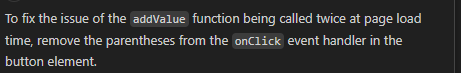

Initially counter value on page load was called twice at load time event before clicking. 
The reason for that is when page loads & if on click has () parenthesis then it will be called at load time.
to fix this issue, I have removed () parenthesis from counter function.
```javascript
let counter = 5;
function App() {
  const addValue = () => {
    console.log("add value");
    counter++;
    console.log(counter);
  };

  return (
    <>
      Fist react project
      <h1> Hello World</h1>
      <h2>Counter value: {counter}</h2>
      <button onClick={addValue()}>Add value</button>
      <br></br>
      <button>Remove value</button>
    </>
  );
}
```
